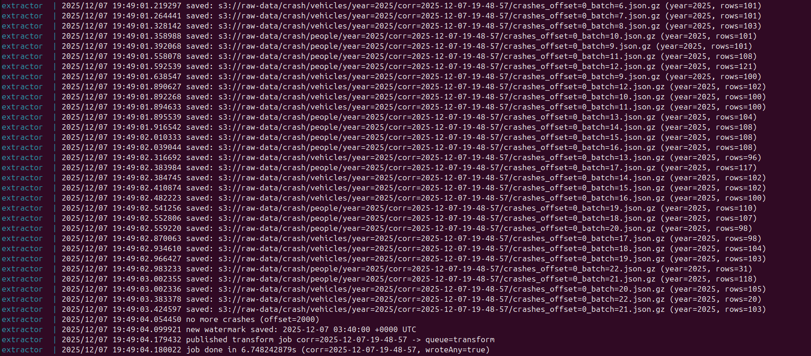
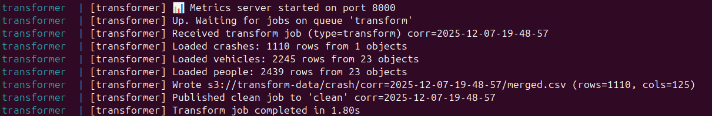
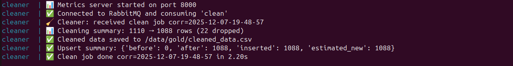
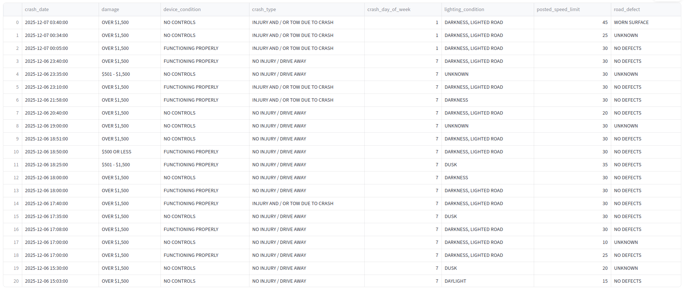
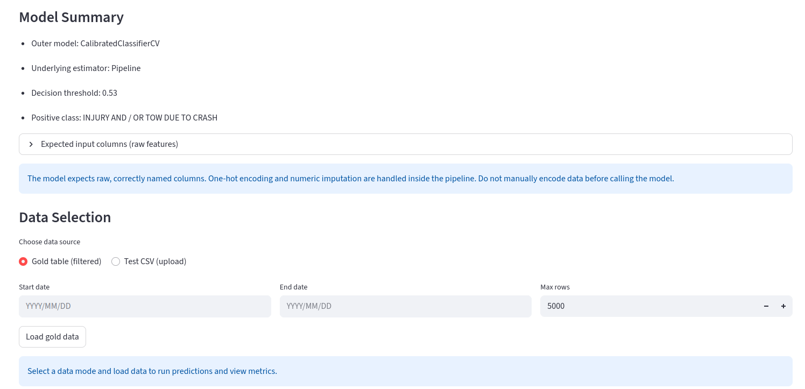
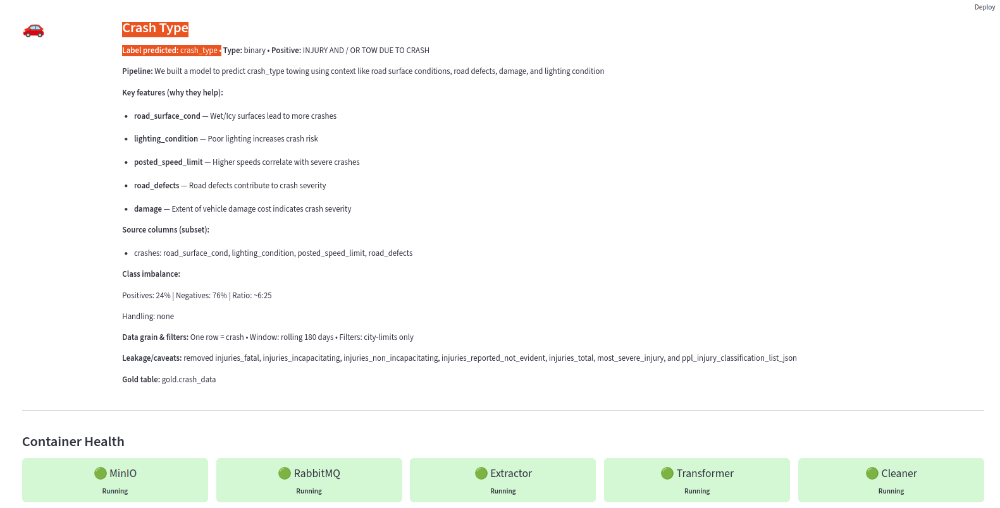
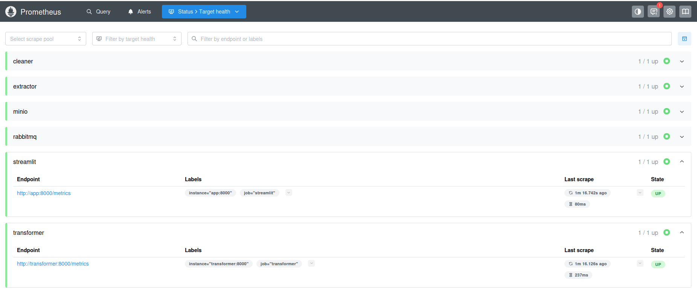
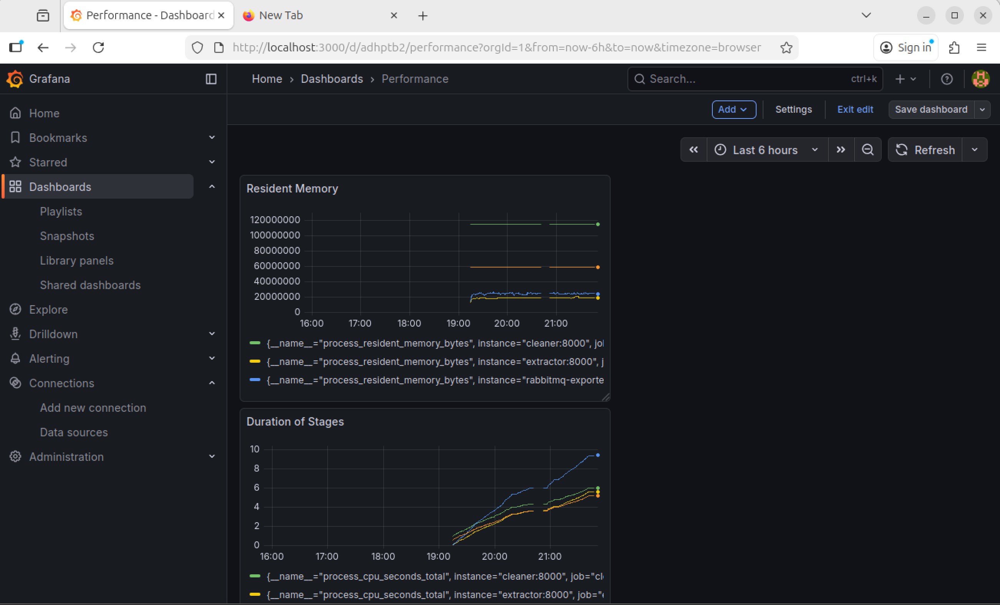
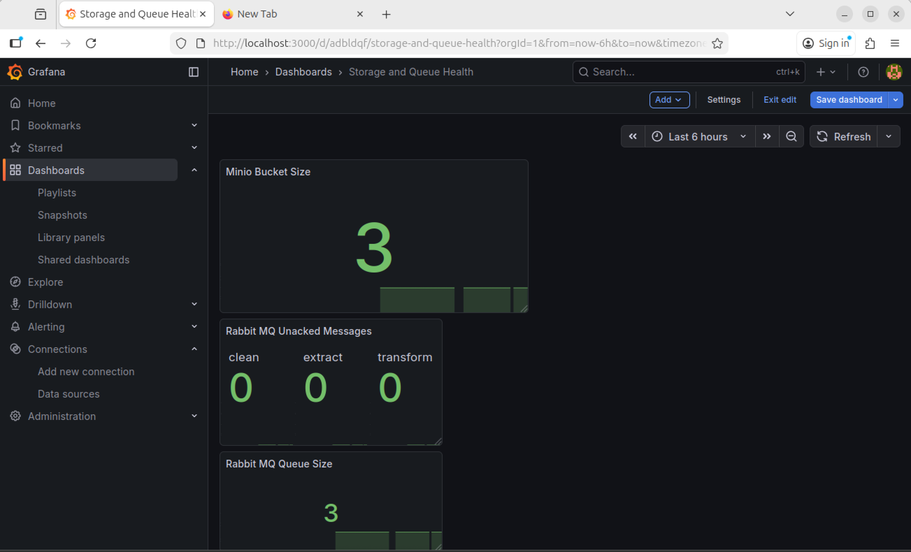
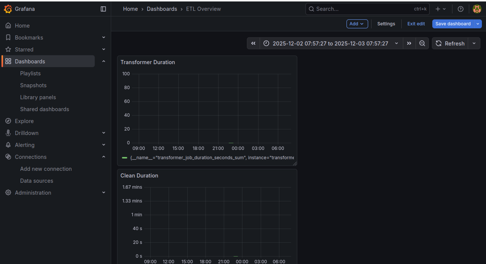

# Chicago Crash Injury Prediction Pipeline

This project implements an end‑to‑end data pipeline to predict whether a traffic crash in Chicago resulted in an injury or fatality, using the **Traffic Crashes – Crashes** dataset from the [Chicago Data Portal](https://data.cityofchicago.org/).  

The system is fully containerized and orchestrated with Docker Compose, and includes:

- A **Go-based extractor**
- **Python transformers and cleaners**
- A **Streamlit web application** for exploration and modeling
- **MinIO**, **RabbitMQ**, **DuckDB**
- **Prometheus** and **Grafana** for monitoring and observability

---

## Table of Contents

1. [Architecture Overview](#architecture-overview)  
2. [Component Walkthrough](#component-walkthrough)  
   - [Extractor (Go)](#extractor-go)  
   - [Transformer (Python)](#transformer-python)  
   - [Cleaner (Python)](#cleaner-python)  
   - [Streamlit Application](#streamlit-application)  
   - [Docker Compose Orchestration](#docker-compose-orchestration)  
   - [Monitoring & Metrics](#monitoring--metrics)  
3. [Running the Pipeline](#running-the-pipeline)  
4. [Metrics & Extra Features](#metrics--extra-features)  
5. [Challenges & Lessons Learned](#challenges--lessons-learned)  
6. [Future Improvements](#future-improvements)  

---

## Architecture Overview

At a high level, the pipeline performs the following steps:

1. **Extract** crash data from the Chicago Data Portal API.  
2. **Store raw data** in **MinIO** (object storage) with watermarks for incremental loading.  
3. **Transform and join** crash, vehicle, and people data into a unified dataset using Python.  
4. **Clean and standardize** the data, then store it in **DuckDB** as a “gold” analytical table.  
5. **Serve a Streamlit app** that:
   - Visualizes the data
   - Triggers data fetching and pipeline runs
   - Trains a model to predict injury/fatality vs. no injury
   - Performs health checks on pipeline components  
6. **Monitor all components** with **Prometheus** and **Grafana** dashboards.

All components run in containers and are wired together via **Docker Compose**.


---

## Component Walkthrough

### Extractor (Go)

**Purpose:** Collect raw crash data from the Chicago Data Portal API.

- Calls the **Traffic Crashes – Crashes** API endpoint.
- Uses a **watermark** strategy (e.g., based on timestamps or IDs) to:
  - Avoid re-downloading data already processed.
  - Support incremental updates.
- Writes the fetched data into **MinIO** as raw JSON or CSV files.
- Each extraction run produces one or more files stored in a dedicated MinIO bucket.



### Transformer (Python)

**Purpose:** Transform raw data into a unified, standardized dataset.

- **Triggering:**  
  - Listens for a **signal from RabbitMQ** to start processing.
- **Input:**
  - Reads crash, vehicle, and people data from **MinIO**.
- **Processing:**
  - Standardizes column names, types, and formats across all pages/tables.
  - Joins crash, vehicle, and people records on `crash_record_id`.
  - Handles multi-page or chunked files by scanning MinIO and combining all relevant files.
- **Output:**
  - Produces a single, consolidated CSV file containing the merged data.
  - Writes the transformed CSV back to MinIO or a staging area for further processing.



### Cleaner (Python)

**Purpose:** Clean and normalize the transformed dataset for modeling.

- **Null handling:**
  - Removes or imputes null values (depending on field importance and type).
- **Standardization:**
  - Normalizes numeric columns (e.g., scaling, type casting).
  - Ensures categorical values are consistent (e.g., upper/lower case, standardized labels).
- **Storage:**
  - Writes the cleaned, “gold” dataset into **DuckDB** (Gold layer).
  - This dataset is what the Streamlit app uses for modeling and visualization.



### Streamlit Application

**Purpose:** Provide a user interface for data exploration, pipeline management, and modeling.

The Streamlit app supports:

- **Data Visualization:**
  - Exploratory views of the crash data stored in DuckDB.
  - Basic charts and summaries (e.g., crash counts, injury vs. non‑injury distribution).
- **Data Fetching:**
  - UI controls or background processes to trigger data extraction from the API.


- **Scheduling / Orchestration Support:**
  - Integrates with the other components via services and queues to coordinate updates.
- **Health Checks:**
  - Queries container health (e.g., ability to connect to MinIO, RabbitMQ, DuckDB).
  - Displays simple system status within the UI.
- **Modeling:**
  - Trains a predictive model to classify whether a crash resulted in an **injury/fatality** or **no injury**.


  - Allows users to:
    - Train or retrain the model based on the current gold dataset.
    - Run predictions on new or historical records.

Access the app at: `http://localhost:8501`



### Docker Compose Orchestration

**Purpose:** Start and connect all services in the correct order.

- The **docker-compose.yml** file defines and coordinates:
  - Extractor
  - Transformer
  - Cleaner
  - Streamlit app
  - MinIO
  - RabbitMQ
  - DuckDB (or the container using it)
  - Prometheus
  - Grafana
- Ensures the pipeline flows correctly:
  1. Raw data to **MinIO**
  2. Transformations to unified CSV
  3. Cleaning to **DuckDB Gold**
  4. Visualization and modeling in **Streamlit**
  5. Metrics collection in **Prometheus**
  6. Dashboarding in **Grafana**

### Monitoring & Metrics

**Purpose:** Provide observability across the entire pipeline.

- **Prometheus** collects metrics exported from:
  - Extractor, Transformer, Cleaner
  - Streamlit app
  - Infrastructure components (e.g., MinIO, RabbitMQ) where applicable
- **Grafana** visualizes metrics in dashboards tailored to:
  - Pipeline throughput and performance
  - Data quality and volume
  - Component health and error rates

Access:

- **Prometheus:** `http://localhost:9090`  


- **Grafana:** `http://localhost:3000`  



---


## Running the Pipeline

1. **Clone the repository**

   ```bash
   git clone <REPOSITORY_URL>
   cd <REPOSITORY_DIRECTORY>
   ```

2. **Create the `.env` file**

   - Use the provided template (e.g., `.env.example`) to create a `.env` file:
     - Fill in required configuration values such as:
       - MinIO credentials and endpoints
       - RabbitMQ credentials
       - Prometheus / Grafana configuration (if needed)
       - Any API keys or URLs for the Chicago Data Portal (if applicable)

3. **Start the stack**

   From the repository root:

   ```bash
   docker compose up -d
   ```

   This will start all services in detached mode.

4. **Access the services**

   - **Streamlit:** `http://localhost:8501`  
   - **Grafana:** `http://localhost:3000`  
   - **Prometheus:** `http://localhost:9090`  

   Follow any dashboard setup instructions in the repo (e.g., importing predefined Grafana dashboards if they are included).

---

## Running on Azure (Cloud Deployment)

In addition to running locally, this pipeline has been successfully deployed and tested on a Microsoft Azure Virtual Machine. This section provides a summary of the cloud environment setup. After completing these one-time setup steps on the VM, the pipeline is run using the same `docker compose up -d` command.

### VM Configuration

The pipeline runs on an Azure VM with the following specifications:

-   **Cloud Provider:** Microsoft Azure
-   **Resource:** Virtual Machine
-   **Operating System:** Ubuntu Server 24.04 LTS
-   **Size:** A cost-effective instance (e.g., `Standard_B2s`) is sufficient.
-   **Authentication:** SSH public key with the username `azureuser`.
-   **Software Prerequisites:** The VM is provisioned with `git`, `docker`, `docker-compose`, `go`, and `python3`.

### Network Configuration (Opened Ports)

To access the services from the internet, the following inbound port rules were added in the Azure Portal under the VM's **Networking** settings. All rules are configured for TCP traffic.

-   **`8501`**: Streamlit application UI
-   **`3000`**: Grafana dashboards
-   **`9090`**: Prometheus metrics server
-   **`9001`**: MinIO Console UI
-   **`22`**: SSH (enabled by default for remote management)

### Folder Structure and Permissions

Before the first run, a specific folder structure for persistent data storage was created in the project's root directory on the VM. Correct permissions are crucial for the containers to run without errors.

-   **Folders Created:**
    -   `minio-data/`
    -   `prometheus_data/`
    -   `grafana_data/`
    -   `duckdb-data/`

-   **Permissions:**
    -   Standard folders were given ownership to the `azureuser` (`sudo chown -R $USER:$USER .`) and write permissions (`chmod -R 755 .`).
    -   **Grafana Specific:** The `grafana_data` directory ownership was specifically set to the Grafana user ID to prevent permission errors: `sudo chown -R 472:472 grafana_data`.

### Key Differences from Local Setup

-   **Environment:** The pipeline runs on a dedicated Ubuntu server in the cloud instead of on a local machine (e.g., Windows with WSL or macOS).
-   **Networking:** Services are accessed via the VM's **public IP address** (e.g., `http://<YOUR_PUBLIC_IP>:8501`) rather than `localhost`. This requires explicitly opening ports in the Azure firewall.
-   **Initial Setup:** The VM requires manual installation of dependencies (Docker, Go, etc.) and manual creation of persistent data folders with specific permissions, which is not always necessary for a local Docker Desktop setup.
-   **`.env` File:** The `.env` file must be created on the VM (e.g., by copying `.env.sample`) before starting the containers, ensuring the environment is configured correctly for the cloud host.

## Metrics & Extra Features

To support detailed monitoring, the pipeline exposes a range of custom metrics, including but not limited to:

- **Data Volume Metrics:**
  - Number of input rows processed
  - Number of output rows generated
  - Number of columns in various stages
  - Detection of empty datasets or failed fetches

- **Storage & Queue Metrics:**
  - **MinIO operations:**
    - Files written, read, failed operations
    - Latency for read/write operations
  - **RabbitMQ operations:**
    - Messages published / consumed
    - Queue sizes and processing latency

These metrics are designed to give a more complete picture of:

- Data quality and pipeline health  
- Where bottlenecks or data issues may be occurring  
- How each component behaves over time

---

## Challenges & Lessons Learned

### Challenges

- **Learning multiple new technologies at once:**
  - Integrating:
    - Multiple Docker containers
    - Code written in **Go** and **Python**
    - Services like **MinIO**, **RabbitMQ**, **Prometheus**, and **Grafana**
  - Managing everything within a **VM** environment added an extra layer of complexity.

- **Orchestration and connectivity:**
  - Ensuring all containers communicated correctly through Docker networks.
  - Handling environment variables, connection strings, and startup order.

- **End‑to‑end data flow:**
  - Designing a coherent pipeline from raw API data all the way to a usable model in Streamlit.
  - Dealing with data shape mismatches and cleaning challenges.

### Lessons Learned

- How to **design and implement a full data pipeline**: from ingestion to model serving.
- How to work effectively with **VMs** and containerized services.
- How to **instrument code with metrics** and:
  - Export those metrics to **Prometheus**
  - Visualize them in **Grafana** dashboards
- How to connect multiple technologies into a single, functioning system.

---

## Future Improvements

If given more time, several enhancements would be prioritized:

- **Richer Streamlit UI:**
  - More polished and interactive visualizations.
  - Better user flows for model training and prediction.
  - More detailed diagnostics of model performance (e.g., ROC curves, confusion matrix).

- **More robust data validation:**
  - Additional data quality checks before each stage.
  - Automated alerts when metrics indicate anomalies.

- **Advanced modeling:**
  - Experimenting with more sophisticated models and feature engineering.
  - Implementing model versioning and comparison.

- **Scheduling and automation:**
  - More formal scheduling for periodic data refreshes (e.g., Cron-like behavior within the stack).

---

For implementation details (file structure, API references, or code examples), refer to the source code in the repository and any module‑specific documentation.
.
